# Manual de Relações

> **Arquivo gerado** a partir de `registry/`. Não edite à mão — rode `pm registry docs`.

Este é o mapa único da plataforma: cada componente, o que faz, quais contratos troca e como é substituível. É a fonte de verdade que humanos leem e a IA consulta.

## Pipeline principal

*De um pedido sobre um projeto existente ao software aprovado, versionado e aprendido.*

```mermaid
flowchart TD
  cognitive_project_analyzer["cognitive.project-analyzer"]
  cognitive_intake["cognitive.intake"]
  cognitive_understanding["cognitive.understanding"]
  cognitive_complexity_estimator["cognitive.complexity-estimator"]
  cognitive_strategy_selector["cognitive.strategy-selector"]
  cognitive_planning_engine["cognitive.planning-engine"]
  cognitive_workflow_generator["cognitive.workflow-generator"]
  orchestration_background_orchestrator["orchestration.background-orchestrator"]
  orchestration_scheduler["orchestration.scheduler"]
  orchestration_task_router["orchestration.task-router"]
  orchestration_context_builder["orchestration.context-builder"]
  orchestration_prompt_builder["orchestration.prompt-builder"]
  execution_execution_manager["execution.execution-manager"]
  execution_deterministic_engine["execution.deterministic-engine"]
  execution_llm_engine["execution.llm-engine"]
  execution_acceptance_engine["execution.acceptance-engine"]
  governance_gatekeeper["governance.gatekeeper"]
  governance_project_manager["governance.project-manager"]
  governance_git_manager["governance.git-manager"]
  knowledge_knowledge_manager["knowledge.knowledge-manager"]
  knowledge_knowledge_processor["knowledge.knowledge-processor"]
  knowledge_evolution_engine["knowledge.evolution-engine"]
  cognitive_project_analyzer --> cognitive_intake
  cognitive_intake --> cognitive_understanding
  cognitive_understanding --> cognitive_complexity_estimator
  cognitive_complexity_estimator --> cognitive_strategy_selector
  cognitive_strategy_selector --> cognitive_planning_engine
  cognitive_planning_engine --> cognitive_workflow_generator
  cognitive_workflow_generator --> orchestration_background_orchestrator
  orchestration_background_orchestrator --> orchestration_scheduler
  orchestration_scheduler --> orchestration_task_router
  orchestration_task_router --> orchestration_context_builder
  orchestration_context_builder --> orchestration_prompt_builder
  orchestration_prompt_builder --> execution_execution_manager
  execution_execution_manager --> execution_deterministic_engine
  execution_deterministic_engine --> execution_llm_engine
  execution_llm_engine --> execution_acceptance_engine
  execution_acceptance_engine --> governance_gatekeeper
  governance_gatekeeper --> governance_project_manager
  governance_project_manager --> governance_git_manager
  governance_git_manager --> knowledge_knowledge_manager
  knowledge_knowledge_manager --> knowledge_knowledge_processor
  knowledge_knowledge_processor --> knowledge_evolution_engine
```

## Camada Cognitiva

### Complexity Estimator `cognitive.complexity-estimator`

- **Estado:** ✅ ativo
- **Tipo:** llm-stage
- **Propósito:** Classifica objetivamente a complexidade (1..5) de cada item, com os fatores que a determinam.
- **Contratos:** entrada `UnderstandingReport`, saída `ComplexityAssessment`
- **Código:** `packages/core/src/cognitive/complexity-estimator.ts`
- **Config:** `capabilities.complexity-estimator`
- **Como trocar:** config/models.yaml -> capabilities.complexity-estimator; prompt em prompts/complexity/.
- **Conexões:**
  - data-flow → Strategy Selector (`ComplexityAssessment`)

### Intake Engine `cognitive.intake`

- **Estado:** ✅ ativo
- **Tipo:** llm-stage
- **Propósito:** Traduz o pedido leigo do usuário em uma solicitação técnica estruturada.
- **Contratos:** saída `StructuredRequest`
- **Código:** `packages/core/src/cognitive/intake.ts`
- **Config:** `capabilities.intake-translator`
- **Como trocar:** config/models.yaml -> capabilities.intake-translator; prompt em prompts/intake/.
- **Conexões:**
  - data-flow → Understanding Engine (`StructuredRequest`)

### Planning Engine `cognitive.planning-engine`

- **Estado:** ✅ ativo
- **Tipo:** llm-stage
- **Propósito:** Transforma o problema em um plano: épico -> funcionalidade -> tarefa -> subtarefa, cada nó com critérios de aceite e dependências.
- **Contratos:** entrada `UnderstandingReport`, saída `Plan`
- **Código:** `packages/core/src/cognitive/planning-engine.ts`
- **Config:** `capabilities.planner`
- **Como trocar:** config/models.yaml -> capabilities.planner (Claude); prompt em prompts/planning/.
- **Conexões:**
  - data-flow → Workflow Generator (`Plan`)
  - writes → Artifact Store — Toda saída de etapa vira artefato (rastreabilidade).

### Project Analyzer `cognitive.project-analyzer`

- **Estado:** ✅ ativo
- **Tipo:** deterministic
- **Propósito:** Produz o mapa do projeto alvo (estrutura, dependências, framework, convenções, comando de teste) UMA vez por run. Reutilizado por Intake, Understanding e Context Builder.
- **Contratos:** entrada `ProjectTarget`, saída `ProjectMap`
- **Código:** `packages/core/src/cognitive/project-analyzer.ts`
- **Como trocar:** Determinístico, zero tokens. Enriquecimento futuro (arquitetura, hotspots via git) sem mudar o contrato.
- **Conexões:**
  - reads → Projects Store — Obtém o ProjectTarget do projeto registrado.
  - data-flow → Intake Engine (`ProjectMap`)
  - data-flow → Understanding Engine (`ProjectMap`)
  - data-flow → Context Builder (`ProjectMap`) — Mapa gerado 1x por run e reutilizado.

### Strategy Selector `cognitive.strategy-selector`

- **Estado:** ✅ ativo
- **Tipo:** deterministic
- **Propósito:** Determinístico: mapeia a complexidade para a estratégia de execução (profundidade, validação, teto de modelo, retries, orçamento).
- **Contratos:** entrada `ComplexityAssessment`, saída `ExecutionStrategy`
- **Código:** `packages/core/src/cognitive/strategy-selector.ts`
- **Config:** `strategies`
- **Como trocar:** config/strategies.yaml — lookup determinístico, sem LLM.
- **Conexões:**
  - data-flow → Planning Engine (`ExecutionStrategy`)

### Understanding Engine `cognitive.understanding`

- **Estado:** ✅ ativo
- **Tipo:** llm-stage
- **Propósito:** Transforma a solicitação em requisitos de engenharia (funcionais, não-funcionais, riscos, ambiguidades).
- **Contratos:** entrada `StructuredRequest`, saída `UnderstandingReport`
- **Código:** `packages/core/src/cognitive/understanding.ts`
- **Config:** `capabilities.understanding`
- **Como trocar:** config/models.yaml -> capabilities.understanding (GLM); prompt em prompts/understanding/.
- **Conexões:**
  - data-flow → Complexity Estimator (`UnderstandingReport`)
  - data-flow → Planning Engine (`UnderstandingReport`) — O plano usa os requisitos, não só a estratégia.

### Workflow Generator `cognitive.workflow-generator`

- **Estado:** ✅ ativo
- **Tipo:** deterministic
- **Propósito:** Determinístico: converte a árvore do plano em um DAG de tarefas, validando topologia e detectando ciclos.
- **Contratos:** entrada `Plan`, saída `WorkflowDAG`
- **Código:** `packages/core/src/cognitive/workflow-generator.ts`
- **Como trocar:** Lógica determinística; sem modelo. Tarefas independentes rodam em paralelo.
- **Conexões:**
  - data-flow → Background Orchestrator (`WorkflowDAG`)

## Camada de Orquestração

### Background Orchestrator `orchestration.background-orchestrator`

- **Estado:** ✅ ativo
- **Tipo:** service
- **Propósito:** Núcleo operacional: mantém o estado do workflow, agenda tarefas, paraleliza, aplica retry/timeout e sincroniza dependências.
- **Código:** `packages/core/src/orchestration/orchestrator/background-orchestrator.ts`
- **Config:** `platform.orchestrator`
- **Como trocar:** Máquina de estados própria sobre SQLite; parâmetros em config/platform.yaml.
- **Conexões:**
  - invokes → Scheduler
  - writes → Event Bus (`PlatformEvent`) — Publica eventos do ciclo de vida do run/tarefa.

### Context Builder `orchestration.context-builder`

- **Estado:** ✅ ativo
- **Tipo:** deterministic
- **Propósito:** Reúne o contexto mínimo relevante por tarefa (arquivos, contratos, decisões, subgrafo do código) sob orçamento rígido de tokens.
- **Contratos:** entrada `TaskSpec`, saída `TaskContext`
- **Código:** `packages/core/src/execution/context-builder.ts`
- **Como trocar:** Port CodeGraphPort: implementação trivial na Camada 2, adaptador Graphify na Camada 5.
- **Conexões:**
  - data-flow → Prompt Builder (`TaskContext`)

### Metrics Manager `orchestration.metrics-manager`

- **Estado:** ✅ ativo
- **Tipo:** deterministic
- **Propósito:** Coleta indicadores de cada execução (tempo, custo, tokens, retries, qualidade) e os grava como MetricEvent.
- **Contratos:** saída `MetricEvent`
- **Código:** `packages/core/src/orchestration/metrics-collector.ts`
- **Como trocar:** Escreve via Metrics Store (infrastructure.metrics-store); consultado por pm metrics.
- **Conexões:**
  - writes → Metrics Store (`MetricEvent`)

### Prompt Builder `orchestration.prompt-builder`

- **Estado:** ✅ ativo
- **Tipo:** deterministic
- **Propósito:** Monta o prompt especializado do executor a partir da tarefa, do contexto e dos critérios de aceite, usando a biblioteca de prompts versionada.
- **Contratos:** entrada `TaskContext`, saída `PromptPackage`
- **Código:** `packages/core/src/cognitive/prompt-builder.ts`
- **Como trocar:** Templates em prompts/; versão registrada no PromptPackage para o Evolution Engine.
- **Conexões:**
  - data-flow → Execution Manager (`PromptPackage`)

### Scheduler `orchestration.scheduler`

- **Estado:** ✅ ativo
- **Tipo:** service
- **Propósito:** Loop que promove tarefas prontas, reivindica com lease, despacha e aplica a escada de retry com escalonamento ao Project Manager.
- **Contratos:** entrada `WorkflowDAG`
- **Código:** `packages/core/src/orchestration/orchestrator/scheduler.ts`
- **Config:** `platform.orchestrator`, `platform.escalation`
- **Como trocar:** Transições de estado em SQLite; retomável via pm run --resume.
- **Conexões:**
  - data-flow → Task Router (`TaskSpec`)

### Task Router `orchestration.task-router`

- **Estado:** ✅ ativo
- **Tipo:** deterministic
- **Propósito:** Escolhe o melhor executor/modelo para cada tarefa por tipo e complexidade, respeitando o teto da estratégia e aplicando fallback.
- **Contratos:** entrada `PlannedTask`, saída `TaskSpec`
- **Código:** `packages/core/src/orchestration/task-router.ts`
- **Config:** `models.routing`, `models.fallbacks`
- **Como trocar:** config/models.yaml -> routing/fallbacks; troca de rota é edição de config.
- **Conexões:**
  - invokes → Capability Resolver — Pede uma capacidade; nunca um modelo.
  - data-flow → Context Builder (`TaskSpec`)

## Camada de Execução

### Acceptance Engine `execution.acceptance-engine`

- **Estado:** ✅ ativo
- **Tipo:** deterministic
- **Propósito:** Valida a tarefa: compila, faz lint, roda testes e checa critérios de aceite. Em falha, devolve resumo para o retry.
- **Contratos:** entrada `ExecutionResult`, saída `ValidationReport`
- **Código:** `packages/core/src/execution/acceptance/acceptance-engine.ts`
- **Como trocar:** Rigor definido pela ValidationLevel da estratégia (smoke/standard/strict).
- **Conexões:**
  - feedback → Scheduler (`ValidationReport`) — Falha reenfileira a tarefa com o resumo do erro (escada de retry).
  - data-flow → Gatekeeper (`ValidationReport`)

### Deterministic Engine `execution.deterministic-engine`

- **Estado:** ✅ ativo
- **Tipo:** deterministic
- **Propósito:** Princípio da plataforma: consultado SEMPRE antes de qualquer modelo. Registra e despacha os executores determinísticos (scaffold, fsops, lint-fix, test-runner, deps, git) — zero tokens.
- **Contratos:** entrada `TaskSpec`, saída `ExecutionResult`
- **Código:** `packages/core/src/execution/deterministic-workers.ts`
- **Como trocar:** Responde 'consigo cumprir esta tarefa?'; só sem alternativa a tarefa vai para o LLM Engine.
- **Conexões:**
  - invokes → Scaffold Worker

### Execution Manager `execution.execution-manager`

- **Estado:** 🕓 planejado
- **Tipo:** service
- **Propósito:** Coordena os workers executores: inicia, acompanha execução, consolida resultados e sincroniza tarefas concluídas.
- **Contratos:** entrada `PromptPackage`, saída `ExecutionResult`
- **Código:** `packages/core/src/execution/execution-manager.ts`
- **Como trocar:** Despacha para workers determinísticos ou LLM conforme o executorKind da TaskSpec.
- **Conexões:**
  - invokes → Deterministic Engine — SEMPRE consultado primeiro (zero tokens).
  - invokes → LLM Engine — Só recebe o que o Deterministic Engine não consegue cumprir.
  - reads → Response Cache — Cache por hash de prompt evita reprocessar a mesma chamada.
  - writes → Artifact Store — Prompts, respostas, diffs e logs viram artefatos.
  - data-flow → Acceptance Engine (`ExecutionResult`)

### LLM Engine `execution.llm-engine`

- **Estado:** ✅ ativo
- **Tipo:** service
- **Propósito:** Encapsula os executores que usam modelo: o worker.llm genérico (por especialidade) e o worker.claude-agent. Só recebe tarefas que o Deterministic Engine não consegue cumprir.
- **Contratos:** entrada `PromptPackage`, saída `ExecutionResult`
- **Código:** `packages/core/src/execution/workers/llm.ts`
- **Como trocar:** Resolve capacidade -> modelo via Capability/Model Resolver; especialidades em config/especialidades.yaml.
- **Conexões:**
  - invokes → LLM Worker (genérico)
  - invokes → Claude Agent Worker

### Claude Agent Worker `execution.worker-claude-agent`

- **Estado:** 🕓 planejado
- **Tipo:** adapter
- **Propósito:** Executa tarefas de código complexas editando arquivos no diretório do projeto, via Claude Agent SDK, de forma não-assistida.
- **Contratos:** entrada `PromptPackage`, saída `ExecutionResult`
- **Código:** `packages/core/src/execution/workers/claude-agent.ts`
- **Config:** `models.models.claude-code`
- **Como trocar:** Implementa CodingAgentPort; allowlist de ferramentas restrita ao subdiretório do projeto.

### Echo Worker `execution.worker-echo`

- **Estado:** ✅ ativo
- **Tipo:** deterministic
- **Propósito:** Executor falso para testar o orquestrador sem custo de LLM: devolve sucesso/falha configurável. Habilita testes offline.
- **Contratos:** entrada `TaskSpec`, saída `ExecutionResult`
- **Código:** `packages/core/src/execution/workers/echo.ts`
- **Como trocar:** Selecionado por executorId=worker.echo; usado nos testes de orquestração.

### LLM Worker (genérico) `execution.worker-llm`

- **Estado:** ✅ ativo
- **Tipo:** llm-stage
- **Propósito:** Um único worker parametrizado por ESPECIALIDADE (backend, frontend, sql, docs, qa...). Adicionar uma nova especialidade é editar YAML, não criar classe.
- **Contratos:** entrada `PromptPackage`, saída `ExecutionResult`
- **Código:** `packages/core/src/execution/workers/llm.ts`
- **Config:** `especialidades`
- **Como trocar:** config/especialidades.yaml mapeia especialidade -> capacidade + template de prompt + convenções. A capacidade resolve o modelo.

### Scaffold Worker `execution.worker-scaffold`

- **Estado:** ✅ ativo
- **Tipo:** deterministic
- **Propósito:** Cria estrutura de projeto a partir de templates (zero tokens). Determinístico vem antes de LLM por eficiência.
- **Contratos:** entrada `TaskSpec`, saída `ExecutionResult`
- **Código:** `packages/core/src/execution/workers/scaffold.ts`
- **Como trocar:** Selecionado por executorId=worker.scaffold.

## Camada de Governança

### Deploy Manager `governance.deploy-manager`

- **Estado:** 🕓 planejado
- **Tipo:** deterministic
- **Propósito:** FUTURO: deploy automático pós-merge (alvos como Cloudflare/VPS). Fora da v1 — registrado para o fluxo já ficar documentado.
- **Como trocar:** Acionado pelo Git Manager após o merge; alvo configurável. Entra depois da v1.

### Gatekeeper `governance.gatekeeper`

- **Estado:** ✅ ativo
- **Tipo:** llm-stage
- **Propósito:** Revisa o diff do run antes da aprovação humana: segredos, arquivos grandes, padrões proibidos (eval), dívida técnica. Checagens determinísticas rodam sempre; um revisor com modelo reforça quando há chave. Emite um veredicto (approve/revise/escalate) e a lista de achados — nunca vaza o segredo, só o tipo e o arquivo.
- **Contratos:** saída `GateReview`
- **Código:** `packages/core/src/governance/gatekeeper.ts`
- **Config:** `capabilities.reviewer-code`
- **Como trocar:** config/models.yaml -> capabilities.reviewer-code (GLM); offline degrada para só-determinístico. Veredicto approve/revise/escalate em verdict.ts.
- **Conexões:**
  - data-flow → Project Manager (`GateReview`)

### Git Manager `governance.git-manager`

- **Estado:** ✅ ativo
- **Tipo:** deterministic
- **Propósito:** Integra ao repositório com segurança: exige working tree limpa, cria uma branch por run (pm/run-<id>), grava um commit WIP durante o trabalho e o reescreve na aprovação. Nunca commita na branch principal; com remote+gh, faz push best-effort e abre o PR (nunca --force). Rejeição descarta a branch.
- **Contratos:** entrada `ApprovalRecord`
- **Código:** `packages/core/src/execution/git-manager.ts`
- **Como trocar:** Determinístico via node:child_process (sem simple-git). Entrega (push/PR) em git-delivery.ts, best-effort só quando há remote e gh.
- **Conexões:**
  - invokes → Deploy Manager — FUTURO: deploy pós-merge. Fora da v1.

### Project Manager `governance.project-manager`

- **Estado:** ✅ ativo
- **Tipo:** deterministic
- **Propósito:** Monta o dossiê de evidências em pt-BR para a decisão humana: o que você pediu, o que mudou, testes, revisão de qualidade e custo. Não decide sozinho — apresenta e registra a decisão do usuário (aprovar/rejeitar via pm approve/reject).
- **Contratos:** entrada `GateReview`, saída `ApprovalRecord`
- **Código:** `packages/core/src/governance/project-manager.ts`
- **Como trocar:** Determinístico: modelo de evidências em pt-BR (evidence-template.ts). A decisão é sempre humana — pm approve/reject grava o ApprovalRecord.
- **Conexões:**
  - feedback → Scheduler — Escalação: replanejar, dividir, rotear ou perguntar ao usuário.
  - data-flow → Git Manager (`ApprovalRecord`)
  - data-flow → Knowledge Manager (`ApprovalRecord`)

## Camada de Conhecimento e Evolução

### Evolution Engine `knowledge.evolution-engine`

- **Estado:** ✅ ativo
- **Tipo:** llm-stage
- **Propósito:** Lê as métricas acumuladas e PROPÕE melhorias (roteamento, prompts, estratégias) com evidência rastreável. GUARDRAIL DURO: analyze() nunca escreve em config/prompts/strategies — só emite propostas (pm evolve report). Offline as propostas saem com source='heuristica' (mecânicas, não fabricadas). Aplicar (pm evolve apply) é humano e fica planned.
- **Contratos:** entrada `MetricEvent`, saída `EvolutionReport`
- **Código:** `packages/core/src/knowledge/evolution-engine.ts`
- **Config:** `capabilities.evolution`
- **Como trocar:** config/models.yaml -> capabilities.evolution (refino opcional do rationale/diff). Guardrail: nunca edita config sem aprovação na v1 — só relatório.
- **Conexões:**
  - reads → Metrics Store (`MetricEvent`)

### Graphify `knowledge.graphify`

- **Estado:** ✅ ativo
- **Tipo:** deterministic
- **Propósito:** A memória estrutural do código: varre o projeto (com teto) e monta o grafo de imports, com relatório navegável no Obsidian (mermaid + hubs) e um graph.json. Se estourar o teto, escreve o grafo parcial e narra o corte. Reduz o custo de reorientação em tokens.
- **Código:** `packages/core/src/knowledge/graphify-worker.ts`
- **Como trocar:** v1: análise de imports embutida (StaticImportCodeGraph), zero token. O graph.json alimenta o PersistedCodeGraph (troca futura do Context Builder). CLI externa via child process fica planned.
- **Conexões:**
  - reads → Context Builder — O grafo alimenta o CodeGraphPort: contexto mínimo por tarefa.

### Knowledge Manager `knowledge.knowledge-manager`

- **Estado:** ✅ ativo
- **Tipo:** service
- **Propósito:** Assina o Event Bus: ao aprovar um run (RunApproved), registra o conhecimento no vault — nota do run, lições dos achados do Gatekeeper, ADR das restrições, índice do projeto —, dispara a destilação e o Graphify. Determinístico e best-effort (nunca derruba o approve).
- **Contratos:** entrada `ApprovalRecord`, saída `KnowledgeNote`
- **Código:** `packages/core/src/knowledge/knowledge-manager.ts`
- **Como trocar:** Escreve markdown no vault (knowledge.obsidian-vault); indexa via FTS5 para a IA ler. Assina o bus como o MetricsCollector — nunca é chamado direto.
- **Conexões:**
  - reads → Artifact Store — Consome os artefatos produzidos no run.
  - writes → Obsidian Vault
  - invokes → Graphify
  - invokes → Knowledge Processor

### Knowledge Processor `knowledge.knowledge-processor`

- **Estado:** ✅ ativo
- **Tipo:** llm-stage
- **Propósito:** Destila o conhecimento bruto em útil, OFFLINE e NÃO-DESTRUTIVO: resumo extrativo, tags por frequência e wikilinks entre notas relacionadas (Jaccard). Marca 'processado'. Notas quase-duplicadas são LIGADAS, nunca apagadas. Refino por modelo é opcional (dormente sem chave).
- **Contratos:** entrada `KnowledgeNote`, saída `DistilledNote`
- **Código:** `packages/core/src/knowledge/knowledge-processor.ts`
- **Config:** `capabilities.context-refiner`
- **Como trocar:** config/models.yaml -> capabilities.context-refiner (refino opcional). Roda após run aprovado e sob demanda; o Context Builder consulta o conhecimento PROCESSADO, não o bruto.
- **Conexões:**
  - reads → Context Builder — O Context Builder consulta o conhecimento PROCESSADO.
  - invokes → Evolution Engine

### Obsidian Vault `knowledge.obsidian-vault`

- **Estado:** ✅ ativo
- **Tipo:** store
- **Propósito:** A memória legível: a pasta knowledge/ é um vault Obsidian. O ObsidianWriter é o ÚNICO ponto de escrita — REDIGE segredos, compõe markdown determinístico (frontmatter + wikilinks) e indexa no FTS5. Idempotente por hash. O usuário navega; a IA lê via índice.
- **Contratos:** saída `KnowledgeNote`
- **Código:** `packages/core/src/knowledge/obsidian-writer.ts`
- **Como trocar:** Markdown puro em knowledge/; nenhum plugin obrigatório. Índice em SQLite FTS5 (KnowledgeStore) — a busca é abstrata (KnowledgeQuery), troca p/ Qdrant é só adaptador.

### Vector Store (Qdrant) `knowledge.vector-store`

- **Estado:** 🕓 planejado
- **Tipo:** store
- **Propósito:** FUTURO: busca semântica com Qdrant. Entra quando a busca FTS5 falhar comprovadamente. Fora da v1.
- **Como trocar:** O contrato de busca (KnowledgeQuery) nasce abstrato para a troca ser só de adaptador.

## Infraestrutura

### Artifact Store `infrastructure.artifact-store`

- **Estado:** ✅ ativo
- **Tipo:** store
- **Propósito:** Materializa o princípio 'toda informação produzida é persistida ou reproduzível'. Índice no banco + conteúdo em workspace/runs/<run-id>/, identificável por run_id + task_id.
- **Contratos:** entrada `Artifact`
- **Código:** `packages/core/src/artifacts/artifact-store.ts`
- **Como trocar:** Tabela artifacts + arquivos em workspace/runs; base do modo replay e da auditoria.

### Response Cache `infrastructure.cache`

- **Estado:** ✅ ativo
- **Tipo:** store
- **Propósito:** Cacheia respostas de modelo por hash do prompt — evita reprocessar a mesma requisição (economia de tokens).
- **Código:** `packages/core/src/db/cache-repo.ts`
- **Como trocar:** Tabela cache no SQLite; chave derivada de modelo+system+user+schema.

### Capability Resolver `infrastructure.capability-resolver`

- **Estado:** ✅ ativo
- **Tipo:** adapter
- **Propósito:** Resolve uma capacidade nomeada (planner, coder-backend...) em um modelo, considerando complexidade e o teto de tier da estratégia. Os componentes nunca citam modelos.
- **Código:** `packages/core/src/adapters/capability-resolver.ts`
- **Config:** `capabilities`
- **Como trocar:** Trocar a estratégia de seleção aqui não mexe no Model Resolver.
- **Conexões:**
  - invokes → Model Resolver

### CLI (pm) `infrastructure.cli`

- **Estado:** ✅ ativo
- **Tipo:** service
- **Propósito:** O comando pm — a interface que o Claude Code aciona. Toda saída tem --json.
- **Código:** `packages/cli/src/index.ts`
- **Como trocar:** Subcomandos em packages/cli/src/commands; o Claude Code narra a saída --json.

### Database (SQLite) `infrastructure.database`

- **Estado:** ✅ ativo
- **Tipo:** store
- **Propósito:** Banco SQLite com estado de runs, tarefas, métricas e cache. Aplica migrações no startup.
- **Código:** `packages/core/src/db/database.ts`
- **Como trocar:** Estado local em workspace/db/platform.db; migrações em packages/core/src/db/migrations.ts.

### Event Bus `infrastructure.event-bus`

- **Estado:** ✅ ativo
- **Tipo:** service
- **Propósito:** Barramento de eventos em memória (sem broker) para desacoplar componentes. Métricas e Knowledge assinam eventos em vez de serem chamados diretamente.
- **Contratos:** entrada `PlatformEvent`
- **Código:** `packages/core/src/shared/event-bus.ts`
- **Como trocar:** Síncrono e determinístico (processo único); todo evento também vira artefato.
- **Conexões:**
  - invokes → Metrics Manager — Métricas ASSINAM eventos — não são chamadas diretamente.
  - invokes → Knowledge Manager — Knowledge também ASSINA eventos.

### Metrics Store `infrastructure.metrics-store`

- **Estado:** ✅ ativo
- **Tipo:** store
- **Propósito:** Persiste MetricEvent — toda chamada de modelo e resultado de tarefa. Combustível do Evolution Engine.
- **Contratos:** entrada `MetricEvent`
- **Código:** `packages/core/src/db/metrics-repo.ts`
- **Como trocar:** Tabela metric_events no SQLite; consultada por pm metrics e pelo Evolution Engine.

### Model Resolver `infrastructure.model-resolver`

- **Estado:** ✅ ativo
- **Tipo:** adapter
- **Propósito:** Resolve um modelo do catálogo para o adaptador do provedor e executa, aplicando a cadeia de fallback em erros retriáveis.
- **Código:** `packages/core/src/adapters/model-resolver.ts`
- **Config:** `models.providers`, `models.fallbacks`
- **Como trocar:** config/models.yaml — catálogo e fallbacks; trocar modelo é editar config, nunca código.
- **Conexões:**
  - invokes → OmniRouter Adapter

### OmniRouter Adapter `infrastructure.omnirouter-adapter`

- **Estado:** ✅ ativo
- **Tipo:** adapter
- **Propósito:** Fala com gateways compatíveis com a API OpenAI (OmniRouter, OpenAI) — cobre DeepSeek, Qwen, GLM, Gemini.
- **Código:** `packages/core/src/adapters/omnirouter.ts`
- **Config:** `models.providers.omnirouter`
- **Como trocar:** Implemente ModelPort em packages/core/src/adapters e registre outro adaptador; models.yaml aponta o provider.

### Projects Store `infrastructure.projects-store`

- **Estado:** ✅ ativo
- **Tipo:** store
- **Propósito:** Registro dos projetos existentes que a plataforma evolui. Cada run aponta para um projeto (feature, bug, ajuste).
- **Contratos:** entrada `ProjectTarget`
- **Código:** `packages/core/src/db/projects-repo.ts`
- **Como trocar:** Tabela projects no SQLite; alimentada por pm projeto add.

### Registry Tools `infrastructure.registry-tools`

- **Estado:** ✅ ativo
- **Tipo:** service
- **Propósito:** Valida o Manual de Relações (registry/) e gera a documentação humana (docs/manual-de-relacoes.md, diagramas).
- **Código:** `packages/registry-tools/src/index.ts`
- **Como trocar:** Validação e geração em packages/registry-tools/src; roda no pre-commit e no pm doctor.

